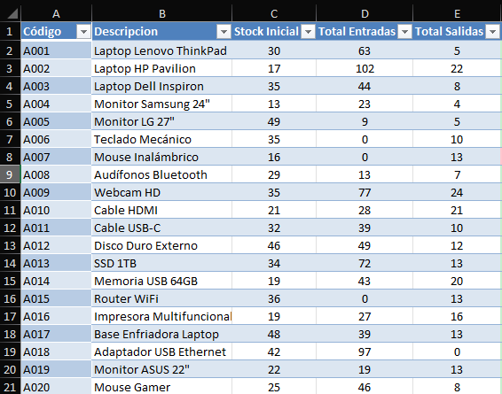

# Proy_Inventario

## Descripcion del proyecto
Este proyecto consiste en un sistema básico de control de inventarios desarrollado en Excel, utilizando tablas estructuradas y tablas dinámicas para el análisis de entradas, salidas y stock de productos tecnológicos.

El objetivo es simular un escenario real de gestión de inventarios, común en áreas de operaciones, logística, análisis de datos y sistemas.

## Objetivo del proyecto
- Registrar un catalogo de productos
- Controlar entradas (compras) y salidas (ventas)
- Analizar movimientos de inventario mediante tablas dinamicas

## Estructura del proyecto
Se tienen 3 hojas, las cuales son:
- Productos (Catalogo de productos tecnologicos) que tiene como columnas: Codigo del producto, Descripcion, Precio unitario y su Stock inicial
  
- Entradas (Compras) y sus columnas son: Fecha, Codigo del producto y Cantidad
  
- Salidas (Ventas) y sus columnas son: Fecha, Codigo del producto y Cantidad
  
  
## Pasos realizados
### Convertir las tablas
Primero "converti" las tablas de cada hoja, en "Tablas Oficiales", esto para que al momento de ingresar las formulas, estas se actualicen automaticamente.

### Crear Hoja Maestra "Inventario"
Ahora lo que siguio fue crear una nueva hoja en la que visualizaremos todos los datos para mostrar cuanto stock tenemos, primero copiaremos el codigo de los productos de la hoja Productos, luego con BUSCARV seleccionamos las columnas de Descripcion y Stock inicial, para que se rellenen los datos automaticamente, luego con SUMAR.SI.CONJUNTO seleccionamos desde la tabla Entradas Cantidad y Codigo producto, ademas A2 para que concuerde con los codigos de los productos, esto lo hacemos con la tabla Entradas y Salidas.

Lo que sigue es encontrar el Stock Actual y su Estado, para esto use C2 + D2 - E2 para realizar la suma, y lo aplique para toda la tabla, sumado ya todo lo ultimo fue mostrar el Estado para esto use =SI(F2<=10, "Pedir Stock", "En Stock") lo cual me dice si hay menos de 10 productos se necesita Stock en caso contrario tenemos buena cantidad de productos, al final solo agregue color con formato condicional para visualizar mejor los datos.

