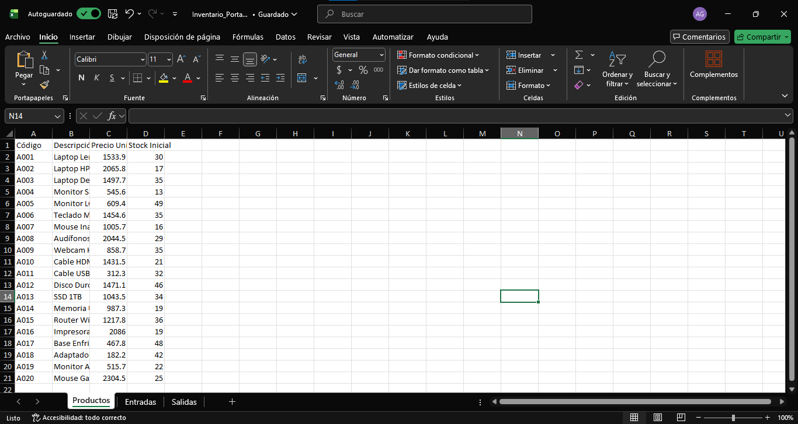
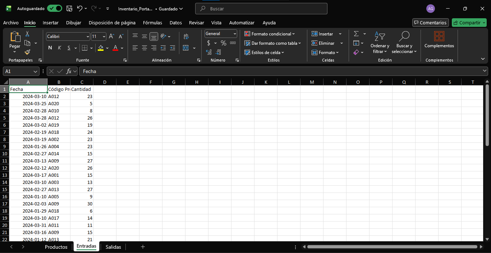
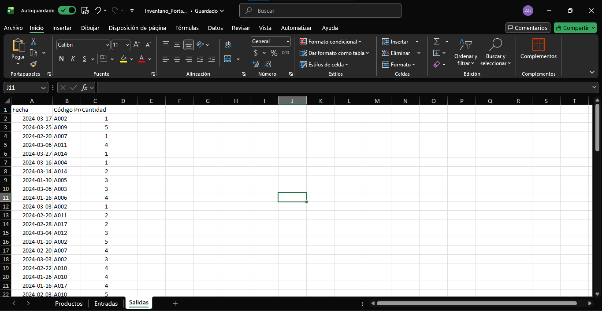
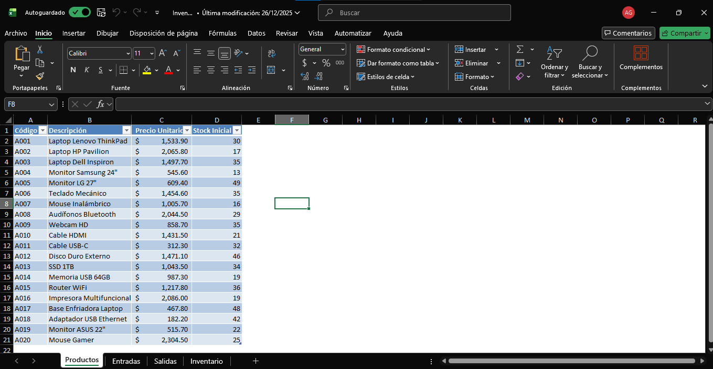

# Proy_Inventario

## Descripcion del proyecto
Este proyecto consiste en un sistema básico de control de inventarios desarrollado en Excel, utilizando tablas estructuradas y tablas dinámicas para el análisis de entradas, salidas y stock de productos tecnológicos.

El objetivo es simular un escenario real de gestión de inventarios, común en áreas de operaciones, logística, análisis de datos y sistemas.

## Objetivo del proyecto
- Registrar un catalogo de productos
- Controlar entradas (compras) y salidas (ventas)
- Analizar movimientos de inventario mediante tablas dinamicas

## Estructura del proyecto
Se tienen 3 hojas, las cuales son:
- Productos (Catalogo de productos tecnologicos) que tiene como columnas: Codigo del producto, Descripcion, Precio unitario y su Stock inicial
  
- Entradas (Compras) y sus columnas son: Fecha, Codigo del producto y Cantidad
  
- Salidas (Ventas) y sus columnas son: Fecha, Codigo del producto y Cantidad
  
  
## Pasos realizados
### Convertir las tablas
Primero "converti" las tablas de cada hoja, en "Tablas Oficiales", esto para que al momento de ingresar las formulas, estas se actualicen automaticamente.

